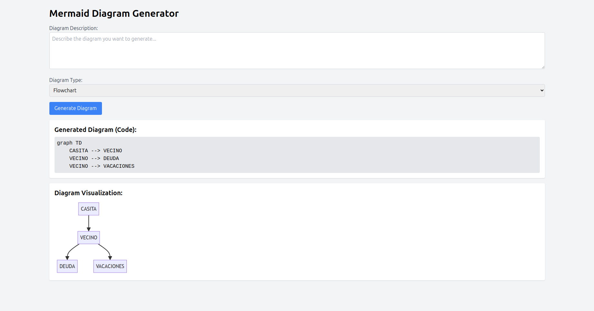

# Natural Language to Mermaid Diagram Generator

This is a simple web app that takes a natural language description of a diagram and generates a mermaid diagram.



## Project Structure

- **main.py**: Contains the FastAPI backend and routes (API and template rendering).
- **templates/index.html**: Jinja2 HTML template styled with Tailwind CSS (via CDN).
- **.env**: File for environment variables (e.g., your OpenAI API key).
- **requirements.txt**: List of dependencies.

## Running the project locally

1. Create the Python virtual environment

```sh
python3 -m venv mermaid-env
```

```sh
source mermaid-env/bin/activate
```

2. Install dependencies:

It is recommended, first, upgrade pip:
```sh
pip install --upgrade pip
```

Install dependencies/requirements:
```sh
pip install -r requirements.txt
```

3. Execute the following command:

```sh
uvicorn main:app --reload --host 0.0.0.0 --port 3000
```

If you want to run the application in debug mode, you can use the following command:

```sh
uvicorn main:app --reload --host 0.0.0.0 --port 3000 --log-level debug
```

4. You should see an output similar to:

```
INFO:     Uvicorn running on http://127.0.0.1:3000 (Press CTRL+C to quit)
INFO:     Started reloader process [XXXXX] using WatchFiles
INFO:     Started server process [XXXX]
INFO:     Waiting for application startup.
INFO:     Application startup complete.
```

## Licensing

All packages in this repository are open-source software and licensed under the **MIT License**. By contributing to this repository, you agree to release your code under this license as well.

Let's build the future of *Natural Language to Mermaid Diagram Generator* together!